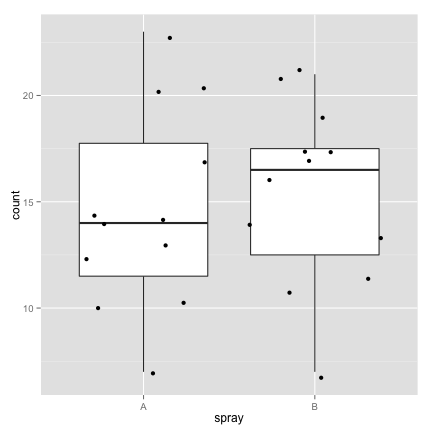

## What is the project?
### Write a shiny application, which must include the following:
1. Some form of input (widget: textbox, radio button, checkbox, ...)
2. Some operation on the ui input in sever.R
3. Some reactive output displayed as a result of server calculations
4. You must also include enough documentation so that a novice user could use your application.
5. The documentation should be at the Shiny website itself. Do not post to an external link.

---

## Question
### Which insect spray is the best?
- Load the "InsectSprays" dataset from R
- Choose any two out of the five insect sprays for comparison
- A boxplot with the count plotted against the spray will be generated
- The mean count of each individual spray will be calculated

---

## Example
#### Let us assume you choose to compare spray A and spray B. Then here is the boxplot that you will see:
<br>
 

---

## Example continued
### And the mean of the count for spray A and spray B will be calculated.
<br>
#### The mean count of spray A is:

```r
round(mean(InsectSprays[which(InsectSprays$spray=="A"),]$count),digits=2)
```

```
## [1] 14.5
```
<br>
#### The mean count of spray B is:

```r
round(mean(InsectSprays[which(InsectSprays$spray=="B"),]$count),digits=2)
```

```
## [1] 15.33
```
